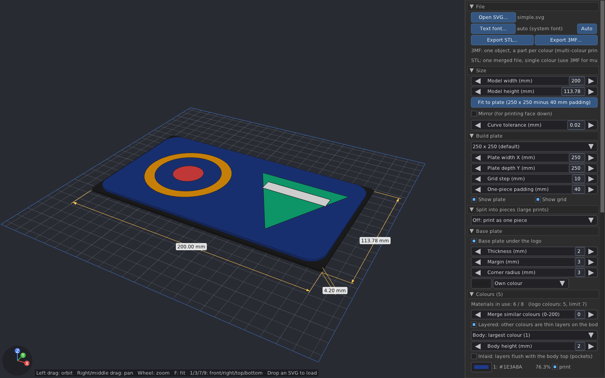
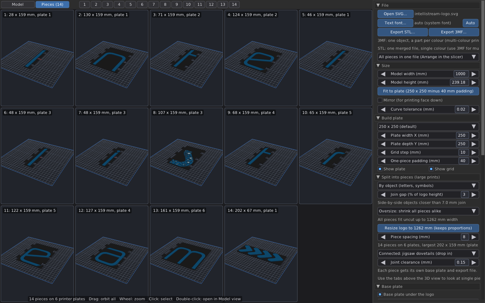

# intellistream-svgto3dprint

Turn an SVG logo into a multi-colour 3D-printable model. Written in C.

* Imports SVG files (paths, basic shapes, transforms, CSS classes, `<use>`,
  clip paths, strokes, gradients as flat colours, and `<text>` rendered with
  a matching system font or a font file of your choice).
* Every fill colour becomes a separate, watertight mesh that is extruded from a
  common base. Up to **8 materials** (colours) per model; extra colours are
  merged automatically, or by hand in the UI.
* Each colour has its **own height**, so the slicer can print flush multi-colour
  faces or staggered levels with fewer filament changes. **Layered** mode
  makes one colour the full body of the logo and puts the other colours on top
  of it as thin layers (raised, or inlaid flush with the body's top).
* Optional base plate with margin and rounded corners.
* Live 3D preview with CAD-style helpers: overall dimensions, per-colour
  height dimensions, printer bed outline, grid, bounding box, axis triad,
  cursor coordinate read-out and a two-point measuring tool.
* Exports **3MF** (one object with one part per colour, extruder assignment
  and colours embedded) and **STL** (one merged file, ready to print as a
  single colour).
* **Split into pieces** for prints larger than the printer: the logo is cut
  into letters/objects or plate-sized tiles, each piece gets its own base plate
  and file, pieces that only fit diagonally are turned automatically, and a
  *Pieces* tab shows every piece on its own plate. A 2 m wide logo becomes a
  set of 25 cm prints.
* **Arranges the pieces on printer plates**: the pieces are packed onto as
  few plates as possible (the *Pieces* tab labels each piece with its plate)
  and exports can write one file per plate.
* **Pieces that lock together without glue**: neighbouring base plates get
  jigsaw dovetail tabs, and optionally *sliding dovetail keys*: small printed
  bars that slide in slots on the underside across every seam and hold the
  pieces down to each other. Push a key back and the pieces come apart again.
* Headless command-line mode for scripting.

The GUI is built on SDL3 + OpenGL 3.2 and the single-header Nuklear toolkit, so
it runs on Linux, Windows and macOS.

The same logo at 1000 mm width, split into 14 letter-sized pieces that each
get their own base plate and export file:

## Building

Dependencies: a C99 compiler, CMake ≥ 3.16 (or GNU make), and SDL3.
Nuklear and libtess2 are vendored in `third_party/`.

### Linux

If your distribution ships SDL3 (Ubuntu ≥ 25.04, Debian 13, Fedora 41, Arch):

    sudo apt install build-essential cmake libsdl3-dev      # Debian / Ubuntu
    sudo dnf install gcc cmake SDL3-devel                   # Fedora

Otherwise CMake downloads and builds SDL3 for you. That needs SDL's own build
dependencies, on Ubuntu 24.04 for example:

    sudo apt install build-essential cmake git libx11-dev libxext-dev \
        libxrandr-dev libxcursor-dev libxi-dev libxfixes-dev libxss-dev \
        libxtst-dev libxkbcommon-dev libwayland-dev libdecor-0-dev \
        libgl-dev libegl-dev libdbus-1-dev

The X11 extension packages (`libxi-dev`, `libxrandr-dev`, `libxtst-dev`, ...)
are optional: when one is missing, CMake switches the SDL feature it enables
off instead of failing and prints which ones. Install the package and re-run
`cmake` to turn the feature back on.

Then:

    cmake -B build -DCMAKE_BUILD_TYPE=Release
    cmake --build build -j
    ./build/intellistream-svgto3dprint examples/simple.svg

With SDL3 installed system-wide you can also use the plain Makefile:

    make -j
    ./intellistream-svgto3dprint examples/simple.svg

### macOS

    brew install cmake sdl3
    cmake -B build -DCMAKE_BUILD_TYPE=Release && cmake --build build -j

### Windows

Use CMake with Visual Studio or MinGW. SDL3 is fetched automatically when it is
not found (`vcpkg install sdl3` also works).

### CPU baseline

x86-64 builds use FMA, which needs Haswell (2013) or newer. For older machines:

    cmake -B build -DLOGO3D_X86_FMA=OFF        # or: make X86_FMA=0

Because a fused multiply-add rounds once where two operations round twice, the
tessellator reaches a different - equally correct - triangulation of the same
shape than a build without one. The tests therefore compare the geometry
(colour slots, areas, volumes, and that every solid is closed) rather than
triangle counts; see `tests/compare_info.py`.

## Using the GUI

    intellistream-svgto3dprint [logo.svg]

* **File**: open an SVG (or drop one onto the window), export STL / 3MF.
  With several pieces the default is all pieces in one file: the 3MF holds
  every piece, and every key, as an object of its own, so *Arrange* in the
  slicer spreads them over its plates. Or choose one file per piece, or one
  file per printer plate (the pieces arranged on it). Opening a file
  resets all model settings; the plate settings are kept. If no native file
  dialog is available, path fields appear as a fallback.
* **Size**: model width or height in millimetres, base plate included (the
  other follows the aspect ratio; default 200 mm wide), mirroring for face-down
  printing, curve tolerance.
* **Split into pieces**: *By object* separates letters and symbols (parts that
  belong together, such as the dot of an i or nested chevrons, stay joined;
  the *join gap* joins side-by-side objects closer than a percentage of the
  logo height), *Plate-sized tiles* cuts the logo into a grid. Pieces are
  turned to fit the plate when that helps. Pieces that still do not fit are
  handled by the *Oversize* policy: shrink all pieces by the same factor
  (default, keeps the logo's proportions), shrink each piece on its own, cut
  into tiles, or keep and warn. "Resize logo to N mm" sets the model size to
  the largest one at which every piece fits unshrunk. The tab bar above the
  3D view then offers a *Pieces* grid (one viewport per piece: left drag to
  orbit all, right or middle drag to pan all, wheel to zoom, `F` to reset,
  double-click to open) and one tab per piece. The pieces
  are also arranged on printer plates, in piece order with *Piece spacing*
  between them; every piece's label names its plate. Every piece
  is exported centred, turned and scaled exactly as shown, one file per piece.
  With a base plate, *Connected plates* gives every row of pieces one
  continuous strip of plate: neighbouring plates meet halfway between the
  pieces with square edges and jigsaw dovetail tabs/sockets (a few per joint,
  adjustable clearance), only the two ends of a row keep rounded corners, so
  the pieces plug together into one plaque. Plate-sized tiles get joints on
  all four sides along the cut lines; tile sizes leave room for the tabs.
  The jigsaw tabs hold the pieces in the plane but nothing stops one piece
  lifting off its neighbour; *jigsaw + sliding dovetail keys* adds that
  lock without glue. Every seam gets one or two slots on the underside of the
  plate, running across the seam, with a dovetail cross-section (4 mm mouth,
  7 mm under the ceiling) that is printable flat without support. A key is a
  separate 24 mm bar (shorter on narrow pieces) that parks inside the
  socket-side piece; after the pieces are dropped together, push each key
  through its slot from below with a fingernail until it stops half way into
  the neighbour, and the two pieces are held together in every direction.
  Push it back and they separate. The keys are exported to a `_keys` file
  next to the pieces, laid out for printing (wide face down, no support);
  print them in the same material and with the same clearance. Keys need a
  base plate of at least 3 mm (the thickness is raised when you switch them
  on) and are placed clear of the tabs, of the corners where seams meet, and
  of each other; a seam too short for both tabs and a key keeps the tabs.
  `intellistream-svgto3dprint --export-test fit.3mf --joints keys` writes two small plates
  with the current joint and a key, to dial in the clearance on your printer
  with a short print before committing to the real pieces.
* **Base plate**: thickness, margin, corner radius, colour (own colour or the
  same material as one of the logo colours).
* **Colours**: one row per colour slot with a colour swatch (click to change the
  print colour), area share, *print* toggle, *merge* into another slot and the
  extrusion height. *Layered* (on by default) stacks the colours: the chosen
  body colour (by default the colour with the largest visible area) covers the
  whole logo footprint at its body height (2 mm), and every
  other colour becomes a layer of its own thickness (default 0.2 mm, one
  print layer) on top of the body; *Inlaid* sinks those layers into pockets
  so the top stays flush.
  Untick it for colours side by side, each with its own height.
* **Split into pieces** also splits a piece that is too large for the plate
  between its objects when that gives upright parts (the four chevrons of the
  IntelliStream logo become two pieces of two), before falling back to
  turning, shrinking or tiling. Every fit check tries rotations. "Apply to all" sets one height; "Stagger" gives each colour a
  different height (first + n·step) so upper layers need fewer filament changes.
  "Merge similar colours" folds near-identical shades together.
* **Build plate**: plate size (presets for common printers including the
  Snapmaker U1, default 250 x 250 mm), grid step, plate/grid visibility, and
  the padding used when fitting a one-piece model (default 40 mm); warns when
  the model does not fit at any angle. Switching the split mode back to one
  piece resizes the model to the plate minus that padding; the Size section
  has a "Fit to plate" button for the same.
* **View**: camera presets (*Bottom* shows the underside with the key
  slots), perspective/orthographic, bounding box,
  dimensions, per-colour heights, outlines, axis triad and the measure tool (click two points on the model).

Mouse: left drag orbits, right/middle drag pans, wheel zooms.
Keys: `F` fit, `0` iso, `1` front, `3` right, `7` top, `9` bottom (shows the
key slots), `P` perspective toggle,
`M` measure tool, `Esc` clear, `Ctrl+O` open, `Ctrl+E` export 3MF.

Colours are quantised so that the whole model uses at most 8 materials
(base plate included). The painter's order of the SVG is respected: a shape
drawn on top cuts a matching hole in the shapes below, so colours never
overlap in the print.

## Command line

    intellistream-svgto3dprint --info logo.svg
    intellistream-svgto3dprint --export logo.3mf --width 150 --base 2 --margin 3 logo.svg
    intellistream-svgto3dprint --export logo.stl --per-color --stagger 0.6,0.2 --no-base logo.svg
    intellistream-svgto3dprint --export big.3mf --width 2000 --split objects --plate 250x250 logo.svg   # big_chunk01.3mf ...
    intellistream-svgto3dprint --export big.3mf --width 2000 --split objects --fit-plate logo.svg      # resize so nothing is shrunk
    intellistream-svgto3dprint --export big.3mf --width 2000 --split objects --single-file logo.svg    # all pieces in one file
    intellistream-svgto3dprint --export big.3mf --width 2000 --split objects --per-plate --spacing 5 logo.svg   # big_plate01.3mf ... pieces arranged
    intellistream-svgto3dprint --export logo.3mf --no-layered --stagger 0.6,0.2 logo.svg              # colours side by side, staggered heights
    intellistream-svgto3dprint --export big.3mf --width 2000 --split objects --joints keys logo.svg    # pieces lock with sliding dovetail keys: big_chunk01.3mf ... big_keys.3mf
    intellistream-svgto3dprint --export big.3mf --width 2000 --split objects --joints keys --single-file logo.svg   # pieces and keys as objects in one 3MF, Arrange in the slicer
    intellistream-svgto3dprint --export-test fit.3mf --joints keys --joint-clearance 0.1               # two test plates and a key to check the fit

`intellistream-svgto3dprint --help` lists every option (sizes, per-slot heights, colour merge
threshold, material limit, base plate colour, mirroring).

## Slicer notes

* The 3MF holds **one object per piece with a part per colour**
  (`base_RRGGBB`, `color1_RRGGBB`, ...), written as an assembly of component
  objects. Parts keep their relative position, which matters for the base
  plate and the layered colours, and the slicer's "object too small, scale
  from inches?" check never fires because it looks at the whole object.
* **OrcaSlicer / Bambu Studio**: the object opens with one part per colour and
  the extruder of every part already set (extruder 1 = base plate, then the
  colours), read from the `model_settings.config` inside the file. The file
  also carries per-triangle colours, so a colour-mapping prompt may appear.
* **PrusaSlicer / SuperSlicer**: the component objects arrive with their
  extruders set; when asked whether to load the file as a single object with
  multiple parts, answer Yes, and No to importing print settings.
* **Several pieces in Orca Slicer / Bambu Studio**: those slicers create
  build plates only from their own project files (which carry your printer
  settings) and load any other 3MF as geometry on one plate. Import the
  pieces and press **Arrange**: the slicer creates plates as needed and
  spreads the pieces over them. For exactly one piece per plate, import the
  per-piece files onto separate plates.
* **One file per printer plate** (`--per-plate`) writes the pieces of each
  plate arranged on it, origin at the plate's front-left corner, for any
  slicer; import one file per plate.
* **Sliding dovetail keys** are objects in the all-in-one 3MF (in a row in
  front of the pieces, base plate colour) and come in their own `_keys` file
  in the per-piece and per-plate modes; print them as they are, wide face
  down. The fit depends on the printer more than on the material:
  shrinkage scales tab and socket alike and is compensated per filament in
  the slicer anyway, while first-layer squish (elephant's foot) and flow do
  change the fit. Print the `--export-test` plates first and adjust the joint
  clearance (0.15 mm default; 0.1 for a snug key, 0.2-0.25 for materials
  that warp such as ABS/ASA).
* Other slicers get a standard 3MF with `basematerials` colours; assign the
  filaments per object manually if needed.
* STL exports one merged file by default (every colour fused into a single
  printable shape, no manual steps needed). Use 3MF for multi-colour
  printing: it is the only format here that reliably carries per-part
  colours and extruders through a slicer's import. `--per-color` on the
  command line writes one STL per colour instead, for slicers/workflows that
  specifically need that; it needs a manual "load as one object with
  multiple parts" step in the slicer (thin colour layers can otherwise be
  auto-scaled 25x by an "is this in inches?" heuristic, or dropped
  individually onto the bed, losing their stacking), and if the slicer asks
  whether a thin layer "is too small, scale to millimetres?", answer No.
* Text is rendered with the closest system font (Helvetica/Arial map to
  Liberation Sans, Arimo or DejaVu Sans on Linux). Pick a specific font file
  with "Text font..." or `--font FILE` for an exact match; draw.io exports
  with multi-line labels are handled.

## Windows and macOS builds

The window icon is compiled in from `assets/intellistream-svgto3dprint.ico` (regenerate
`src/icon_data.h` with `tools/mkicon.py` after changing it); on Windows the
same file becomes the executable's icon.

The code is portable C on SDL3. `CMakeLists.txt` builds with Visual Studio,
MinGW or Xcode/clang and fetches SDL3 automatically. The GitHub Actions
workflow in `.github/workflows/build.yml` builds Linux, Windows and a universal
macOS executable on every push and publishes them as artifacts; push the
repository to GitHub to get downloadable binaries without a local toolchain.

### Cross-compiling the Windows build on Linux

Install the mingw-w64 cross toolchain:

    sudo apt install mingw-w64      # Debian / Ubuntu
    sudo dnf install mingw64-gcc    # Fedora

Then configure with the toolchain file in `cmake/mingw-w64.cmake`, which
points CMake at the mingw-w64 compilers and lets it cross-fetch and build
SDL3 for Windows:

    cmake -B build-win -DCMAKE_TOOLCHAIN_FILE=cmake/mingw-w64.cmake -DCMAKE_BUILD_TYPE=Release
    cmake --build build-win -j
    file build-win/intellistream-svgto3dprint.exe   # PE32+ executable (console) x86-64, for MS Windows

`build-win/intellistream-svgto3dprint.exe` runs under Wine or on real Windows; the tests
(`tests/run_tests.sh`) need a Windows host or Wine to run, since ctest
invokes the freshly built executable directly.

## Releases

    make release VERSION=v1.2.3

tags and pushes the release (the working tree must be clean). Pushing a
version tag triggers `.github/workflows/release.yml`, which builds Linux,
Windows and macOS binaries and publishes them to a GitHub Release with notes
generated from the commits since the previous tag.

Delete a tag (`git tag -d v1.2.3 && git push origin :refs/tags/v1.2.3`) and
its release from GitHub to redo a botched one before re-tagging.

## Tests

    make test            # or: ctest --test-dir build

Three layers:

* `tests/test_region.c`: unit tests for the polygon operations in
  `src/region.c` (normalisation, union, subtraction, intersection, rectangle
  clipping). They check areas and contour counts against known shapes, and
  that every result is clean: no sliver edges, every vertex a real corner, no
  bridged contours. That is what keeps the extruded meshes closed.
* `tests/test_ui.c`: headless checks of the Nuklear widgets the GUI relies
  on, with input fed by hand (the colour picker keeps tracking a drag that
  leaves it, so pure white is reachable).
* `tests/run_tests.sh`: converts every example in `examples/` through the
  command line in the main modes (plain, split into objects and tiles, side
  by side, no base, mirrored, ...), validates every exported mesh (closed
  shells, 3MF part ranges, materials and extruders) and compares the
  `--info` statistics with the recordings in `tests/expected/`, including
  the plate arrangement; per-plate exports must keep every piece on its plate
  without overlaps. Examples with `<text>` are rendered with Liberation Sans
  so the recordings do not depend on the machine's fonts (without it only
  their meshes are checked). The mesh checks need python3.

The recordings pin the current geometry down. After a deliberate change in
what the program produces, re-record them and review the diff:

    UPDATE=1 sh tests/run_tests.sh ./intellistream-svgto3dprint

## Licence

Licensed under the [Apache License, Version 2.0](LICENSE).

Third-party components keep their own licences; see `THIRD_PARTY.md`.
